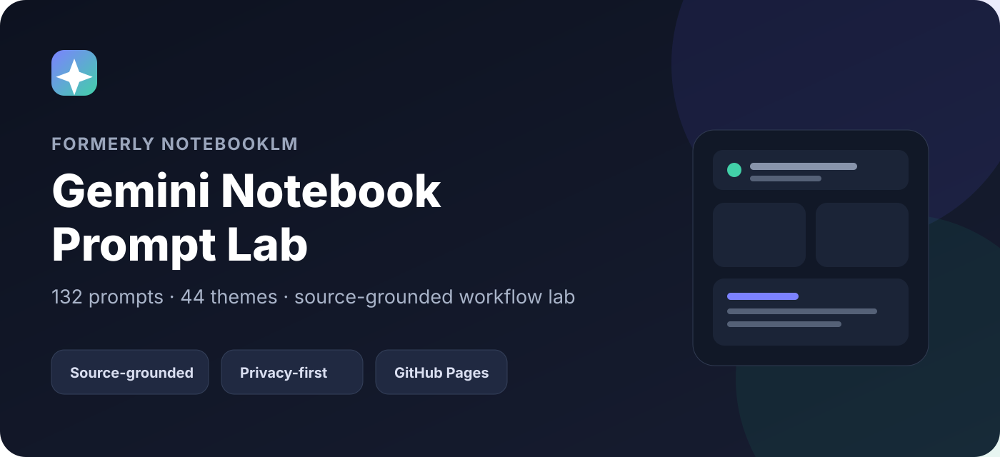
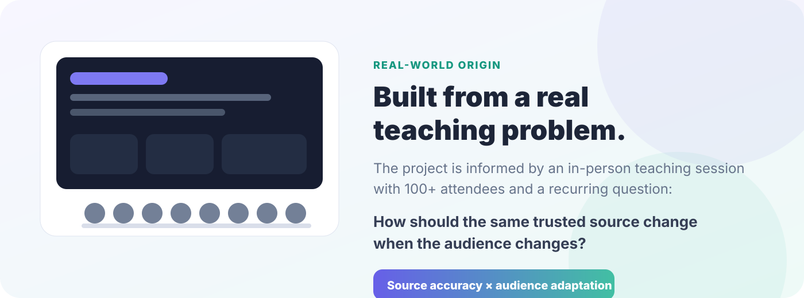

<div align="center">



# 🧠 Gemini Notebook 提示詞工作室

**為 Gemini Notebook（原 NotebookLM）打造的本機優先、來源限定、分齡提示詞庫與工作流工具。**

[English](README.md) · [🚀 直接打開網站](https://dennis23100.github.io/gemini-notebook-prompt-lab/) · [🖼️ 可重現 Showcase](https://dennis23100.github.io/gemini-notebook-prompt-lab/showcase.html) · [最新版本](https://github.com/dennis23100/gemini-notebook-prompt-lab/releases/latest) · [Issues](https://github.com/dennis23100/gemini-notebook-prompt-lab/issues)


</div>

## 直接在網站看成果

網站提示詞庫會顯示 7 個主題、兒童／青年／成熟讀者三種受眾的 Gemini Notebook 實際輸出範例。Repository README 改為文字導覽，不再嵌入預覽圖；請直接開啟網站，以卡片尺寸瀏覽真實預覽。

**預覽狀態：** 真實輸出卡片使用原始 `1376 × 768` PNG，不使用 sprite 拼接、JPEG 轉檔或放大的縮圖；其他卡片會明確標示為 CSS 風格預覽。

| 受眾 | 預設年齡區間 | 呈現方向 |
|---|---:|---|
| **兒童** | 15 歲以下 | 清楚、溫暖、好記、降低資訊密度 |
| **青年** | 16–34 歲 | 有動能、好共感、保留適度深度 |
| **成熟讀者** | 35 歲以上 | 穩重、有內容、高可讀性 |

實際生成不是固定模板，因此不同來源、不同次生成仍可能出現不同視覺表現。像 **「漫畫（不拘）」** 本來就是方向而不是死板畫風；它可以依來源與受眾變成漫畫、水墨式敘事、電影感分鏡或其他合適的視覺語言。

網站中對應的 Prompt 卡片會直接使用原始 PNG，並維持原生 16:9 比例；其他卡片則繼續使用輕量的 CSS 風格預覽。

### 🚀 [直接打開 Prompt Lab 試用](https://dennis23100.github.io/gemini-notebook-prompt-lab/)

## 這個專案在解決什麼？

很多 Prompt repository 最後只是一長串文字清單。這個專案從一個更實際的問題開始：

> **同一份可信來源，真的應該用完全相同的方式呈現給兒童、青年與成熟讀者嗎？**

Gemini Notebook 提示詞工作室會維持來源內容的忠實度，同時依受眾調整用字、資訊密度、節奏與視覺方向。

## 你可以做什麼？

- **📚 提示詞庫**：90 組 Prompt = 30 種視覺主題 × 3 種受眾。
- **🧪 提示詞工作室**：依工作流、受眾、聚焦主題、視覺主題、難度、角色與額外要求快速組合 Prompt。
- **🔗 流程串接**：把「萃取 → 產出 → 驗證」做成可重複工作流。
- **✅ 品質檢查**：用透明本機規則檢查來源限定、防杜撰、受眾、任務、格式與約束。
- **⭐ 收藏／最近使用／匯入／匯出**：全部存在瀏覽器本機。
- **🔗 可分享篩選網址**：目前提示詞庫的篩選狀態可以放進 URL。
- **📦 JSON / Markdown / CSV**：可匯出目前篩選結果。
- **🌐 獨立成品語言**：Prompt 維持一致的英文核心，成品可跟隨 Gemini Notebook，或明確指定繁體中文／English。
- **📱 PWA / 離線**：不需要專案帳號或後端。

提示詞庫會**預設選擇「兒童」**，一開始只顯示 30 組，不再把 90 組全部混在一起。年齡是三選一，永遠保留一個選擇；分類／風格則可以再次點擊目前選項來取消，立刻回到該年齡的全部 30 種主題。

## 使用方式

```text
1. 選受眾 + 視覺主題
           ↓
2. 複製來源限定 Prompt
           ↓
3. 用新分頁打開 Gemini Notebook
           ↓
4. 搭配自己的可信來源生成
```

網站本身沒有專案後端、登入系統、分析 SDK、資料庫或內嵌 API key。

## 真實範例、風格預覽與可重現 Benchmark

網站提示詞庫目前有 21 張逐張驗證過的原始 PNG 範例；其他卡片仍採用快速的 CSS 風格預覽，並明確標示為示意。如此能清楚區分真實輸出與風格方向，也不會再依賴格式損壞、解析度不足或被拉伸的圖片。

另外，專案仍保留一套**可重現 Showcase**：使用固定的專案自製測試來源與精確 Prompt manifest，讓貢獻者不用猜來源或 Prompt 就能重做真實成果比較。

### 🖼️ [打開可重現 Showcase](https://dennis23100.github.io/gemini-notebook-prompt-lab/showcase.html)

Mockup 不會冒充真實生成結果；真實成果必須附有來源紀錄，並通過 PNG 簽章、解碼、尺寸與引用檢查後，才會放進 README 或 Prompt Library。

## 來自真實教學情境

這個專案受到真實教學經驗影響，其中包含一次**台下 100+ 位聽眾**的實體教學分享。這段經驗讓一件事情更明確：教學不只是資訊正確，呈現方式、節奏與受眾適配同樣重要。



上面是專案自行製作的起源示意圖，不是現場照片。更多背景請看：[專案故事](docs/PROJECT_STORY.zh-TW.md)。

## 這是一個持續維護的 OSS

- [最新 Release](https://github.com/dennis23100/gemini-notebook-prompt-lab/releases/latest)
- [Open Issues](https://github.com/dennis23100/gemini-notebook-prompt-lab/issues)
- [`good first issue`](https://github.com/dennis23100/gemini-notebook-prompt-lab/issues?q=is%3Aissue+is%3Aopen+label%3A%22good+first+issue%22)
- [`help wanted`](https://github.com/dennis23100/gemini-notebook-prompt-lab/issues?q=is%3Aissue+is%3Aopen+label%3A%22help+wanted%22)
- [如何參與](CONTRIBUTING.md)
- [Security](SECURITY.md)
- [Code of Conduct](CODE_OF_CONDUCT.md)

修改程式或資料前：

```bash
cd notebooklm
npm run check
```

## 現在適合參與的項目

- 跨瀏覽器鍵盤／Accessibility 測試；
- 日文 UI / metadata 翻譯；
- 有清楚來源紀錄的更多真實輸出範例；
- Community Prompt Packs；
- Prompt、文件與 UX 的小型改善。

## 授權與來源

- Repository／網站程式碼：**MIT**。
- 本專案自行建立與改寫的 Prompt、metadata：請看 `notebooklm/LICENSE-DATA.md` 與 [LICENSING.md](LICENSING.md)。
- 上游靈感來源與 attribution：`notebooklm/THIRD_PARTY_NOTICES.md`。

本專案與 Google 無官方關係；Gemini Notebook、NotebookLM 名稱只用來描述相容產品。

---

<div align="center">

### 🚀 [直接打開 Gemini Notebook 提示詞工作室](https://dennis23100.github.io/gemini-notebook-prompt-lab/)

如果這個專案對你有用，請真的使用、回報問題、改善 Prompt、送一個聚焦 PR，或 Star 讓更多人找到它。

</div>
